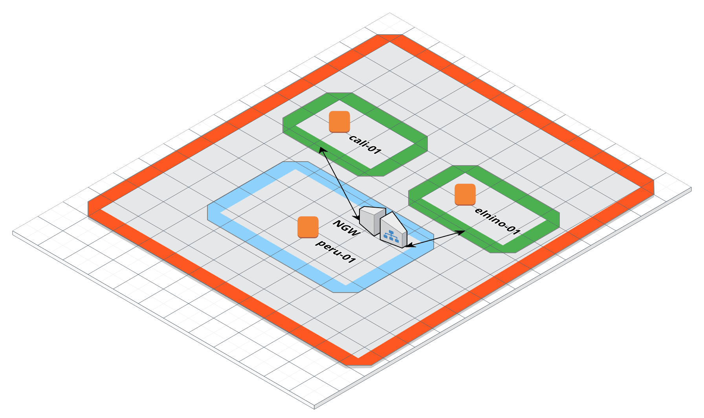
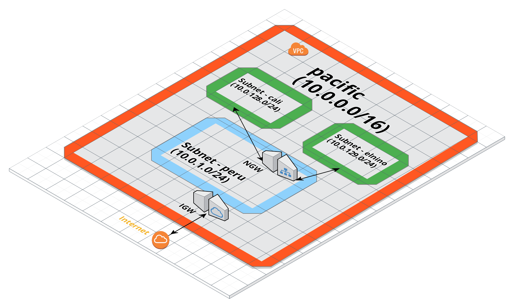

# prov_aws_ec2_terraform

Provision AWS EC2 instances with Terraform using modules

The example here provides [Terraform](https://www.terraform.io/) scripts to
provision instances in public and private subnets. These instances can be
only be accessed from a bastion host in the public subnet. The layout looks
like this:



Underlying network looks like following:



## Why Modules?

[Modules](https://www.terraform.io/docs/modules/index.html) make it easier to
break down the scripts into reusable pieces. These pieces can then be used to
compose infrastructure components as per requirements. Since modules are
dependent on each other by exported variables, the module implementation can
change anytime without affecting any dependent components.

The scripts in this project have been broken down into two modules
- instances-private
    - provisions instances in private subnet
    - the required variables are either defined in module or read from external
      state file
- instances-public
    - provisions instances in public subnet
    - the required variables are either defined in module or read from external
      state file

## Executing the scripts

- Install terraform (we're using version v0.11.8)
- Clone the repo
- Run `terraform init` to initialize the modules and provider
- Export AWS account keys

```
$ export AWS_ACCESS_KEY_ID=myawsaccesskeyid
$ export AWS_SECRET_ACCESS_KEY=myawsecretaccesskey
```

- Run `terraform plan` to dry-run the scripts
- If everything looks good, run `terraform apply`
- If you need to change any values, it's recommended to override the variables
  in environment rather than changing the code e.g. if you need to change the
  name of vpc, which is defined as `vpc_name` in `variables.tf` file, do the following

```
$ export TF_VAR_vpc_name=my_vpc_name
$ terraform plan
$ terraform apply
... output
```
